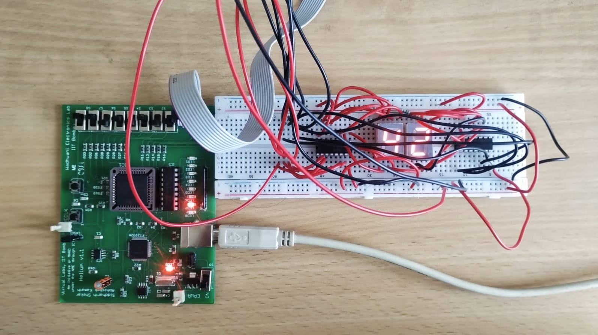
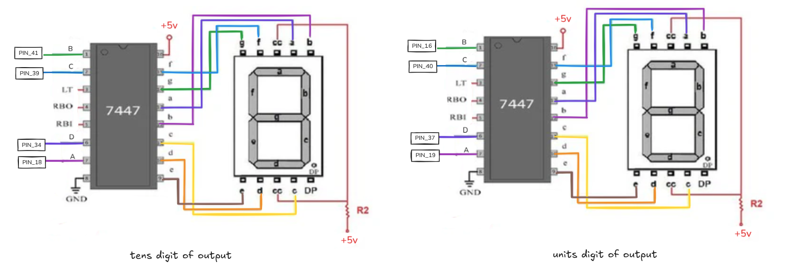
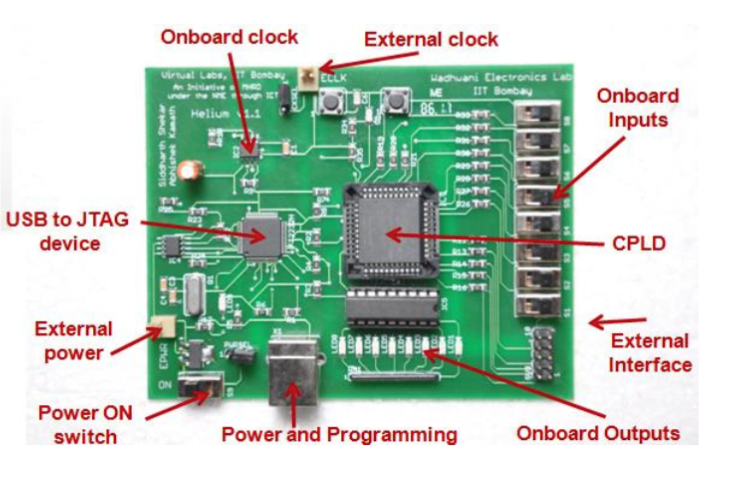
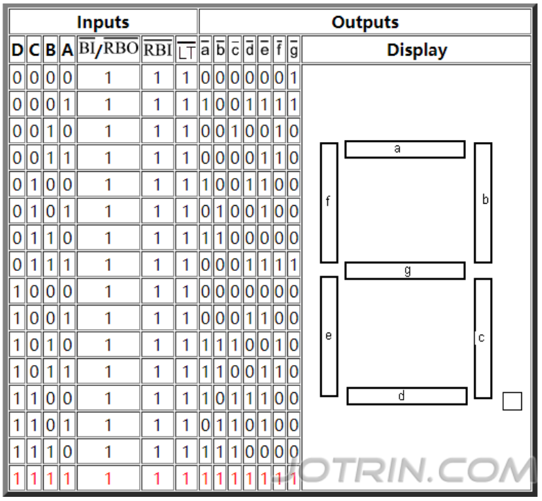

# CPLD Arithmetic Game using Verilog

*ELL201 Sem-2 2024-25 Project*



## Overview

FPGA Memory Game Implementation
This Verilog code implements a memory-based arithmetic game on MAX3000A CPLD using Verilog. The system operates on a 1Hz clock, with each game cycle broken into five distinct phases:

1. A 5-bit Linear Feedback Shift Register (LFSR) generates
pseudo-random numbers, which are displayed one at a
time and internally summed.
2. After displaying the numbers, the screen is cleared to
allow the player to input their calculated sum using the
onboard switches.
3. The system then displays the correct sum and compares
it to the player’s input.
4. LED indicators provide immediate feedback, showing
success or failure through predefined light patterns.
5. Finally, the system resets automatically to begin a new
game round

A separate binary_to_BCD module handles conversion for the 7-segment display.


### Game Phase Overview

| Cycle Counter | Action | Display Output | LED Status |
|---------------|--------|----------------|------------|
| 0-3 | Generate random number (LFSR) | Random value | Reflect LFSR value (padded) |
| 4 | Clear display | 0 | OFF |
| 5-10 | Accept user input via switches | Switch value converted to decimal | OFF |
| 11-12 | Display correct answer | Sum modulo 100 | LEDs ON (success or pattern) |
| 13-14 | Hold result display | Sum modulo 100 | LEDs remain in previous state |
| 15 | Reset game | 0 | LEDs ON |

## Pin Configuration

### Clock and Display
| Signal | Pin | Description |
|--------|-----|-------------|
| clk    | 43  | Global clock (1Hz) |
| o_clk  | 24  | Output clock (to monitor output) |

<table width="100%">
  <tr>
    <td width="25%" valign="top">
      <h3>LED Indicators</h3>
      <table>
        <tr><th>Signal</th><th>Pin</th></tr>
        <tr><td>led[6]</td><td>33</td></tr>
        <tr><td>led[5]</td><td>31</td></tr>
        <tr><td>led[4]</td><td>29</td></tr>
        <tr><td>led[3]</td><td>28</td></tr>
        <tr><td>led[2]</td><td>27</td></tr>
        <tr><td>led[1]</td><td>26</td></tr>
        <tr><td>led[0]</td><td>25</td></tr>
      </table>
    </td>
    <td width="33%" valign="top">
      <h3>BCD Display Outputs</h3>
      <table>
        <tr><th>Signal</th><th>Pin</th></tr>
        <tr><td>bcd_tens[3]</td><td>34</td></tr>
        <tr><td>bcd_tens[2]</td><td>39</td></tr>
        <tr><td>bcd_tens[1]</td><td>41</td></tr>
        <tr><td>bcd_tens[0]</td><td>18</td></tr>
        <tr><td>bcd_units[3]</td><td>37</td></tr>
        <tr><td>bcd_units[2]</td><td>40</td></tr>
        <tr><td>bcd_units[1]</td><td>16</td></tr>
        <tr><td>bcd_units[0]</td><td>19</td></tr>
      </table>
    </td>
    <td width="33%" valign="top">
      <h3>Input Switches</h3>
      <table>
        <tr><th>Signal</th><th>Pin</th></tr>
        <tr><td>switch[7]/rst</td><td>14</td></tr>
        <tr><td>switch[6]</td><td>12</td></tr>
        <tr><td>switch[5]</td><td>11</td></tr>
        <tr><td>switch[4]</td><td>9</td></tr>
        <tr><td>switch[3]</td><td>8</td></tr>
        <tr><td>switch[2]</td><td>6</td></tr>
        <tr><td>switch[1]</td><td>5</td></tr>
        <tr><td>switch[0]</td><td>4</td></tr>
      </table>
    </td>
  </tr>
</table>

## Programming Instructions
### JITAG commands
```
cable ft2232
detect
svf <file_locaion.svf>
```

## Demonstration 


## Some useful data
some resource which came in handy during the project







## Contibutors
- Team GMP (Good morning pineapple)
